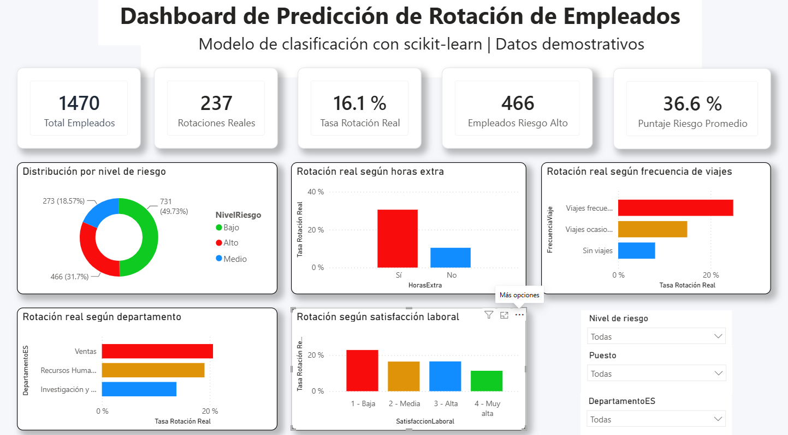
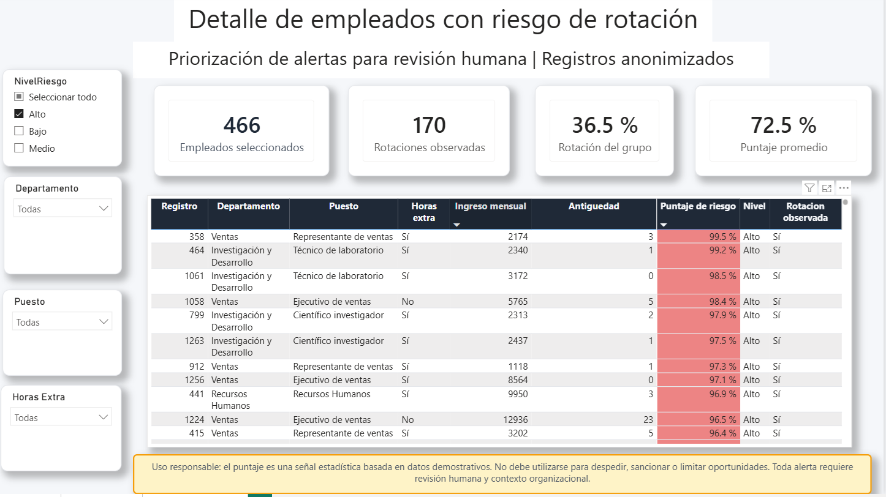
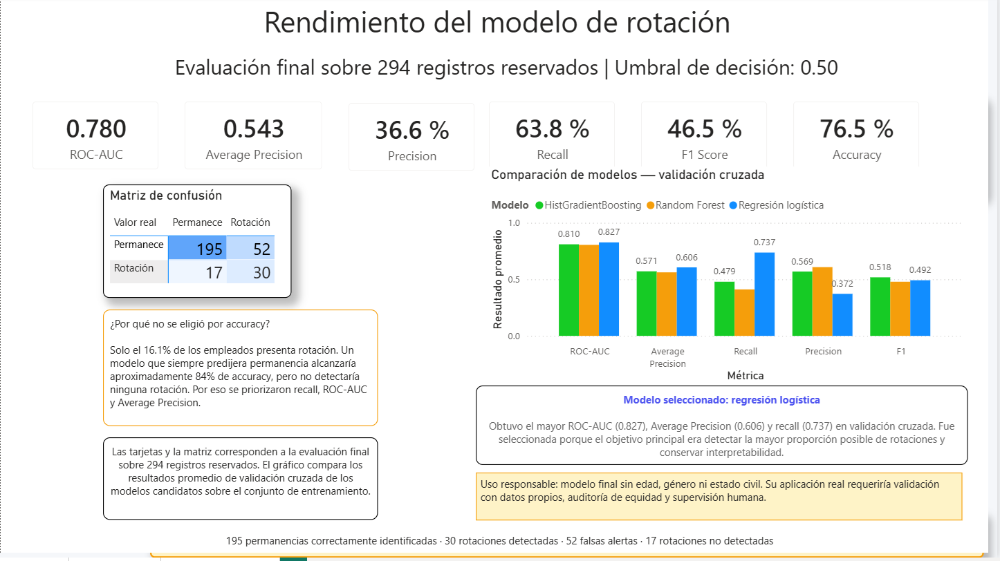

# Predicción de rotación de empleados con scikit-learn y Power BI

Proyecto de analítica y machine learning que estima el riesgo de rotación de empleados y presenta los resultados en un dashboard interactivo para apoyar la toma de decisiones de Recursos Humanos.

> **Nota:** este proyecto utiliza datos públicos y demostrativos. Las predicciones son señales estadísticas para priorizar revisiones humanas; no deben utilizarse para despedir, sancionar o limitar oportunidades laborales.



## Objetivo

Desarrollar una solución de principio a fin que permita:

- identificar patrones relacionados con la rotación;
- estimar la probabilidad de rotación de cada empleado;
- comparar varios algoritmos de clasificación;
- priorizar casos que requieren revisión humana;
- comunicar hallazgos mediante un dashboard de Power BI.

## Tecnologías utilizadas

- Python
- pandas y NumPy
- matplotlib y seaborn
- scikit-learn
- joblib
- Power BI y Power Query
- Google Colab

## Datos

Se utilizó el conjunto público [IBM HR Analytics Employee Attrition & Performance](https://www.kaggle.com/datasets/pavansubhasht/ibm-hr-analytics-attrition-dataset), disponible en Kaggle.

El archivo contiene **1,470 registros** y **35 variables**. La variable objetivo es `Attrition`:

| Clase | Empleados | Proporción |
|---|---:|---:|
| Permanece | 1,233 | 83.88 % |
| Rotación | 237 | 16.12 % |

La distribución muestra un problema de clasificación desbalanceado. Por esa razón, la evaluación no se basó únicamente en accuracy.

## Principales hallazgos exploratorios

- Los empleados que realizan horas extra presentan una tasa de rotación de **30.53 %**, frente a **10.44 %** entre quienes no las realizan.
- La rotación alcanza **24.91 %** entre quienes viajan frecuentemente, frente a **8.00 %** entre quienes no viajan.
- El nivel más bajo de satisfacción laboral presenta una rotación de **22.84 %**; el nivel más alto, **11.33 %**.
- El nivel más bajo de equilibrio trabajo-vida presenta una rotación de **31.25 %**.
- Los empleados que rotaron muestran menores medianas de edad, ingreso mensual y antigüedad que quienes permanecieron.

Estos resultados describen asociaciones en el conjunto de datos; no demuestran relaciones causales.

## Metodología

### 1. Preparación de los datos

Se eliminaron variables constantes o sin valor predictivo:

- `EmployeeCount`
- `EmployeeNumber`
- `Over18`
- `StandardHours`

Para reducir riesgos de uso discriminatorio, el modelo final también excluye `Age`, `Gender` y `MaritalStatus`.

Los datos se dividieron en entrenamiento y prueba mediante una partición estratificada de **80/20**, con `random_state=42`. El conjunto final de prueba contiene **294 registros** que no participaron en el entrenamiento.

### 2. Preprocesamiento reproducible

Todo el preprocesamiento se integró en un `Pipeline` de scikit-learn para evitar fuga de información:

- variables numéricas: imputación por mediana y estandarización;
- variables categóricas: imputación por moda y codificación one-hot;
- clases: ponderación balanceada durante el entrenamiento.

### 3. Comparación de modelos

Se compararon tres algoritmos mediante validación cruzada estratificada de cinco particiones sobre el conjunto de entrenamiento:

| Modelo | ROC-AUC | Average Precision | Precision | Recall | F1 |
|---|---:|---:|---:|---:|---:|
| Regresión logística | **0.827** | **0.606** | 0.372 | **0.737** | 0.492 |
| Random Forest | 0.805 | 0.562 | **0.608** | 0.411 | 0.479 |
| HistGradientBoosting | 0.810 | 0.571 | 0.569 | 0.479 | **0.518** |

Se seleccionó la **regresión logística** porque obtuvo el mayor ROC-AUC, Average Precision y recall, además de ofrecer mayor interpretabilidad para un caso de Recursos Humanos.

### 4. Selección del umbral

Se evaluaron distintos umbrales para convertir la probabilidad estimada en una alerta:

| Umbral | Precision | Recall | F1 | Rotaciones detectadas | Alertas falsas |
|---:|---:|---:|---:|---:|---:|
| 0.40 | 0.303 | 0.702 | 0.423 | 33 | 76 |
| **0.50** | **0.366** | 0.638 | **0.465** | 30 | **52** |

Se conservó el umbral de **0.50** porque ofrece un mejor equilibrio y reduce significativamente las alertas falsas. Un umbral de 0.40 podría utilizarse si la organización priorizara una mayor sensibilidad y tuviera capacidad para revisar más alertas.

## Resultados finales

El modelo responsable final se evaluó una sola vez sobre los 294 registros reservados:

| Métrica | Resultado |
|---|---:|
| ROC-AUC | 0.780 |
| Average Precision | 0.543 |
| Precision | 36.6 % |
| Recall | 63.8 % |
| F1-score | 46.5 % |
| Accuracy | 76.5 % |

### Matriz de confusión

| Valor real / Predicción | Permanece | Rotación |
|---|---:|---:|
| Permanece | 195 | 52 |
| Rotación | 17 | 30 |

El modelo detectó **30 de las 47 rotaciones reales**. Generó **52 alertas falsas** y no detectó **17 rotaciones**.

La accuracy no fue la métrica principal: debido al desbalance, un modelo que siempre predijera permanencia alcanzaría aproximadamente 84 % de accuracy sin detectar ninguna rotación. Por ello se priorizaron recall, ROC-AUC y Average Precision.

## Variables relacionadas con el riesgo

El análisis de importancia por permutación destacó principalmente:

- horas extra;
- número de empresas en las que ha trabajado el empleado;
- años desde la última promoción;
- frecuencia de viajes;
- satisfacción laboral;
- capacitación recibida;
- participación en el trabajo;
- ingreso mensual y antigüedad con el gerente actual.

La importancia predictiva indica cuánto ayuda una variable al modelo, pero no implica causalidad ni justifica decisiones individuales automáticas.

## Dashboard en Power BI

El dashboard está compuesto por tres páginas:

1. **Resumen ejecutivo:** indicadores generales, distribución del riesgo y tasas de rotación por horas extra, viajes, departamento y satisfacción laboral.
2. **Detalle de riesgo:** listado anonimizado de empleados priorizados, filtros y formato condicional para facilitar la revisión humana.
3. **Rendimiento del modelo:** métricas finales, matriz de confusión y comparación de modelos mediante validación cruzada.

### Resumen ejecutivo


### Detalle de riesgo



### Rendimiento del modelo



## Estructura del proyecto

```text
prediccion_rotacion_empleados/
├── README.md
├── notebooks/
│   ├── 01_analisis_exploratorio_rotacion.ipynb
│   └── 02_modelado_rotacion.ipynb
├── dashboard/
│   ├── Dashboard_Rotacion_Empleados_Final.pbix
│   └── Dashboard_Prediccion_Rotacion_Empleados.pdf
├── imagenes/
│   ├── 01_resumen_ejecutivo.png
│   ├── 02_detalle_riesgo.png
│   └── 03_rendimiento_modelo.png
├── datos/
│   ├── employee_attrition_limpio.csv
│   └── resultados_dashboard_rotacion.csv
└── modelo/
    └── modelo_rotacion_final.joblib
```

## Cómo reproducir el proyecto

1. Clonar o descargar el repositorio.
2. Instalar las dependencias principales:

   ```bash
   pip install pandas numpy matplotlib seaborn scikit-learn joblib
   ```

3. Abrir y ejecutar los notebooks en este orden:

   ```text
   notebooks/01_analisis_exploratorio_rotacion.ipynb
   notebooks/02_modelado_rotacion.ipynb
   ```

4. Abrir `dashboard/Dashboard_Rotacion_Empleados_Final.pbix` en Power BI Desktop.
5. Si Power BI no encuentra el CSV, actualizar la ruta del origen hacia `datos/resultados_dashboard_rotacion.csv`.

## Uso responsable y limitaciones

- El conjunto de datos es demostrativo y no representa necesariamente una empresa real.
- El tamaño de la muestra y la cantidad de casos positivos limitan la generalización.
- El modelo no determina por qué una persona podría abandonar la empresa.
- Una alerta no debe interpretarse como certeza ni utilizarse como evaluación de desempeño.
- Toda acción requiere revisión humana, contexto organizacional y validación con datos locales.
- Antes de un uso real se necesitarían evaluaciones periódicas de sesgo, calibración, estabilidad y deriva de datos.

## Próximos pasos

- validar el modelo con datos reales y de distintos periodos;
- calibrar las probabilidades y definir el umbral según el costo de cada error;
- incorporar monitoreo de desempeño y deriva;
- evaluar equidad entre grupos sin utilizar atributos protegidos para decidir;
- desplegar una interfaz controlada para predicciones y seguimiento de alertas.

## Autor

**Sergio Ibarra**  
Proyecto de portafolio de análisis de datos, machine learning y visualización empresarial.

